# MyAgentCLI 设计文档

> 日期: 2026-07-02 | 状态: Design Approved

## 概述

MyAgentCLI 是一个个人 AI Agent 助手，CLI 形式。使用 DeepSeek V4 Pro（1M token 上下文窗口，1.6T 参数 / 49B 激活参数 MoE，支持 Non-think / Think High / Think Max 三种推理模式，MIT 协议）作为基础模型，通过 LiteLLM 统一模型接入层。技术栈 Python，Rich + prompt_toolkit 构建 REPL 界面，pipx/pip 分发。

---

## 一、整体架构

### 四层异步单体 + MCP 子进程

```
┌─────────────────────────────────────────────────────────────────┐
│                         CLI Layer                                │
│  ┌─────────────┐  ┌──────────────┐  ┌────────────────────────┐  │
│  │ REPL Engine │  │ Agent        │  │ Slash Commands         │  │
│  │ (prompt_    │  │ Inspector    │  │ /mode /goal /skills     │  │
│  │  toolkit)   │  │ Pane (Rich   │  │ /dream /clear /history  │  │
│  │             │  │ Layout+Live) │  │                        │  │
│  └──────┬──────┘  └──────┬───────┘  └───────────┬────────────┘  │
├─────────┼────────────────┼──────────────────────┼───────────────┤
│         │    Application Layer                  │                │
│  ┌──────┴──────────┐ ┌───────────────┐ ┌───────┴──────────────┐│
│  │  Agent Engine   │ │ Goal Tracker  │ │ Session Manager     ││
│  │  (ReAct Loop)   │ │ (目标追踪层)   │ │ (transcripts,       ││
│  │                 │ │              │ │  resume, history)   ││
│  └──────┬──────────┘ └───────┬───────┘ └─────────────────────┘│
│         │                    │                                   │
├─────────┼────────────────────┼───────────────────────────────────┤
│         │            Service Layer                               │
│  ┌──────┴──────────┐ ┌───────┴───────┐ ┌───────────────────────┐│
│  │ Tool Registry   │ │ Sub-Agent Pool│ │ Memory Store          ││
│  │ (built-in + MCP)│ │ (async tasks, │ │ (files indexing,      ││
│  │                 │ │  isolation)   │ │  dream loops)         ││
│  └──────┬──────────┘ └───────┬───────┘ └───────────────────────┘│
│         │                    │                                   │
├─────────┼────────────────────┼───────────────────────────────────┤
│         │         Infrastructure Layer                           │
│  ┌──────┴────────────────────┴──────┐ ┌────────────────────────┐ │
│  │       LiteLLM Provider           │ │  MCP Protocol Stack    │ │
│  │  deepseek-v4-pro  │  others...   │ │  (subprocess, stdio)   │ │
│  └──────────────────────────────────┘ └────────────────────────┘ │
└─────────────────────────────────────────────────────────────────┘
```

### 层职责

| 层 | 组件 | 职责 |
|----|------|------|
| CLI | REPL Engine | prompt_toolkit 输入处理（自动补全、历史、多行编辑） |
| CLI | Agent Inspector Pane | Rich Layout+Live 固定右侧运行状态窗格（token、上下文、目标、子Agent、工具、重试状态） |
| CLI | Slash Commands | `/mode` `/goal` `/skills` `/dream` `/clear` `/history` `/exit` |
| Application | Agent Engine | 唯一 ReAct 循环：Think → Decision → Execute → Observe |
| Application | Goal Tracker | Goal 追踪叠加层，done 时检查目标是否达成；goal 变更带版本快照，运行中的旧 goal check 结果不得覆盖新目标状态 |
| Application | Session Manager | 会话持久化（JSON+Markdown transcript）、恢复、历史列表 |
| Service | Tool Registry | 统一 Tool 接口，内置工具注册 + MCP 工具发现/代理 |
| Service | Sub-Agent Pool | 子Agent 生命周期管理、并发控制、上下文隔离 |
| Service | Memory Store | 文件记忆索引、语义召回、梦境反思循环 |
| Infrastructure | LiteLLM Provider | 模型统一抽象、流式输出、思考模式切换、fallback |
| Infrastructure | MCP Protocol | MCP 标准协议栈，子进程 + stdio/SSE 通信 |

### CLI 布局与运行状态

CLI 首屏由对话区、底部输入区和右侧 `Agent Inspector Pane` 组成。Inspector 是固定在当前页面内的运行状态窗格，不使用弹出详情窗，也不滚走；用户在长任务、并行子 Agent 或高 token 消耗场景下始终能看到状态。

对话区必须绘制明确的窗格边界，并在渲染前按终端 cell 宽度换行，避免中英文、emoji 或长路径直接越界截断。对话记录使用对齐的角色前缀（如 `You |`、`Agent |`、`System |`、`Tool |`）和必要的空行区分问答轮次。Agent 回复可在显示层做轻量 Markdown-ish 整理，将紧凑的标题、粗体标记、分隔线、列表、术语说明列表和简单表格拆成更易阅读的纯文本行，但不改变持久化 transcript 原文。用户在 Agent 尚未完成回答时继续提交的普通问题进入可见 `Queue |` 区域；只有当该输入取得串行处理锁、真正开始执行时，才移动为下一条 `You |` transcript 记录，避免后续回答与错误的问题视觉配对。`/goal <text>` 等即时控制命令不进入等待队列，也不生成新的 `You |` 对话轮次，而是立即更新 goal 状态并显示 `System | Goal set: ...`。

`REPLEngine` 负责输入焦点和流式输出，`AgentInspectorPane` 只订阅运行时状态快照并渲染，不直接读取或修改 Agent、工具、子 Agent 的内部对象。所有状态来自 `RuntimeStatusModel`，由 Agent Engine、LLM Provider、Tool Registry、Sub-Agent Pool 和 Goal Tracker 通过事件更新。

终端宽度足够时，Inspector 固定在右侧，默认宽度 32-36 列。终端宽度低于 `collapse_below_columns` 时自动折叠成窄 rail，仅显示 token/context 百分比、活跃子 Agent 数、当前工具/错误状态；默认快捷键 `F2` 临时展开或收起完整窗格，快捷键可配置。

交互式 chat window 由单个 prompt_toolkit full-screen `Application` 持有，输入框、对话视口和 Inspector 在同一终端页面内刷新；兼容的 prompt-style REPL 路径仍由 CLI 布局层统一持有 Rich Live。两条路径都避免多个 Live display 竞争焦点。渲染失败时记录结构化错误日志，并降级为最小状态行，不中断正在执行的 ReAct 循环。

### 核心执行流程

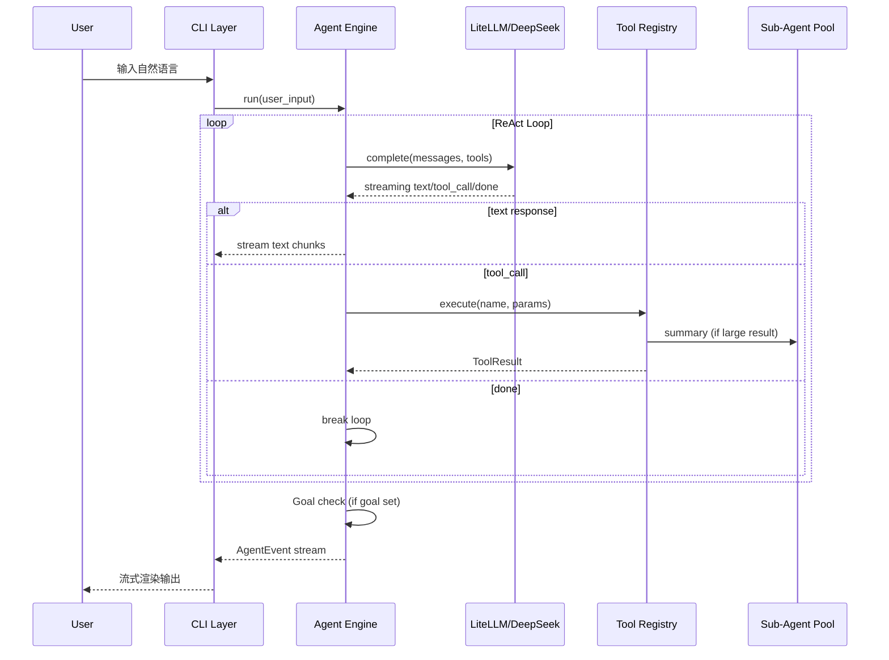

### 无复杂度路由器

Agent 不在代码层面预判任务复杂度。模型在 Think 阶段自行决定：
- 是否直接输出文本（简单问答）
- 是否调用工具（需要操作）
- 是否需要子Agent、多少个、串行还是并行（复杂任务编排）
- 用户输入是纠正/停止/插入新任务（意图理解）

### 多实例支持

每个 `myagent` CLI 进程是完全独立的实例，共享项目配置和记忆文件但不共享运行时状态。用户可以打开多个终端窗口，各自独立运行 Agent 会话。

---

## 二、核心 Agent 循环

### ReAct Loop（唯一执行模式）

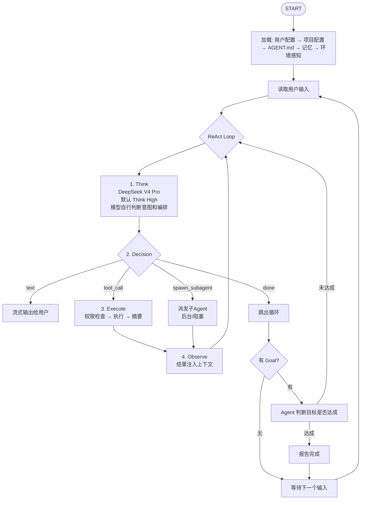

### 用户交互（自然语言，Agent 自行理解意图）

不使用 `/stop`、`/insert` 等命令。所有中断和调整通过自然语言表达：

| 用户说 | Agent 识别为 |
|--------|-------------|
| "别改了，停下来" | 停止当前操作 |
| "不对，你应该先用 pytest" | 方向纠正 |
| "先帮我查一下 Redis 的版本" | 插入新任务 |
| "继续" 或 "go on" | 继续执行 |

遇到需要用户决策的事件（如选择使用哪个方案），Agent 可以反问用户，设置 120s 超时，超时后 Agent 自行决策。**注意：工具权限确认不受此超时限制，权限确认会一直等待用户响应。**

### 思考模式

用户手动选择，默认 Think High：

- `Non-think`: 快速直接响应
- `Think High`: 完整思维链推理（默认）
- `Think Max`: 最强推理，适合复杂架构设计、深度调试

通过 `/mode think-high|think-max|non-think` 切换。

### LLM 错误处理与重试

当 LLM API 调用失败时，Agent 按以下策略处理：

| 错误类型 | 判断条件 | 策略 |
|----------|----------|------|
| 瞬时错误 | HTTP 429 / 5xx, 连接超时 | 指数退避重试，最多 3 次，初始间隔 2s，上限 30s |
| 可重试错误 | `retryable=True` 的 `LLMError` | 同上，使用 LiteLLM 内置 retry 机制 |
| 致命错误 | HTTP 4xx (非 429), 认证失败 | 不重试，立即报错给用户 |
| 流中断 | 流式响应中途断开 | 保留已接收内容 + 注入截断提示，允许用户决定是否继续 |

重试逻辑内置在 `LLMProvider` 中，对上层透明。每次重试时更新 Agent Inspector Pane 显示重试进度。连续 3 次重试失败 → 降级提示用户检查网络/API key。

子 Agent 的 LLM 调用共享同一重试策略。子 Agent API 调用失败默认不通知用户（静默重试），仅在最终失败时将错误信息返回给主 Agent。

### 自然语言 → 工作流编排

`spawn_subagent` 是唯一的编排原语。模型在 Think 阶段自行组合实现：

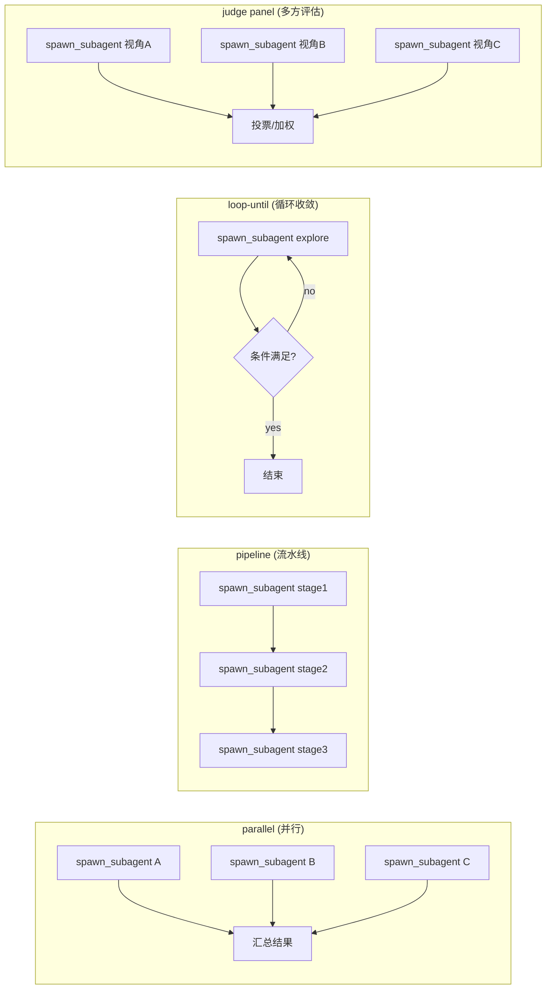

用户也可以用自然语言指定编排："先把这三个文件各自审查一遍，然后汇总结果"。

---

## 三、上下文分层结构

### 六层模型

```
上下文窗口 (跟随模型上限)
┌─────────────────────────────────────────────────────────┐
│  L6: Current Input         ← 当前轮用户输入              │
├─────────────────────────────────────────────────────────┤
│  L5: Conversation          ← 动态增长，可压缩            │
│       用户消息 ↔ 模型响应 ↔ 工具调用/结果               │
├─────────────────────────────────────────────────────────┤
│  L4: Memory                ← 从 memory/ 加载相关记忆     │
├─────────────────────────────────────────────────────────┤
│  L3: Project Context       ← AGENT.md, 配置, 环境感知   │
├─────────────────────────────────────────────────────────┤
│  L2: Skills Registry       ← 名称+描述 index，按需加载  │
├─────────────────────────────────────────────────────────┤
│  L1: Tools Schema          ← function calling 格式       │
├─────────────────────────────────────────────────────────┤
│  L0: System Prompt          ← 固定，不可驱逐             │
└─────────────────────────────────────────────────────────┘
```

### 主 Agent vs 子 Agent 上下文

| | 主 Agent | 子 Agent |
|---|---|---|
| 窗口大小 | 跟随模型上限 | 跟随模型上限，自动继承主Agent |
| L1 Tools | 全部内置 + MCP 工具 | spawn 时可通过 tools 参数指定子集 |
| L2 Skills | 完整 skills index | 不加载（子Agent 不 invoke skill） |
| L3 Project | 完整加载 | 按需传递（仅传递与子任务相关的项目上下文） |
| L4 Memory | 完整加载（语义匹配后） | 不加载（避免上下文污染） |
| L5 Context | 全对话历史 | 仅 spawn prompt + 自身执行过程 |

### 发送到 API 的实际格式

发送给 DeepSeek V4 Pro 的请求结构：

- **system**: L0（行为准则）+ L3（项目上下文）+ L4（相关记忆）+ L2 skills index
- **tools**: L1 工具 schemas（function calling 通道）
- **messages**: L5 对话历史 + L6 当前输入

L2 技能完整内容仅在 invoke 时加载到 system prompt，避免一直占用上下文。

### 压缩策略（四层渐进）

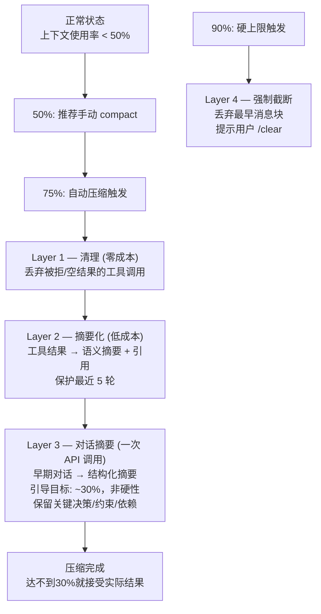

**防抖保护**:
- 最少 10 轮消息才触发压缩
- 压缩后 token 减少 < 10% → 跳过
- Layer 3 连续失败 3 次 → 禁用该层，降级

**可配置**: `primary_threshold: 0.75`, `target_after: 0.30`（引导值，非硬约束）, `hard_limit: 0.90`（硬截断线）

### 持久化策略

所有记录必须持久化，确保可追溯。上下文中保留语义摘要，完整内容存文件：

```
~/.myagent/sessions/
├── <project-name>/                  ← 项目名 (从目录名取)
│   ├── <project-hash>/              ← 项目绝对路径的 SHA256 前 7 位
│   │   ├── <session-id>/            ← 日期-短随机串，如 2026-07-02-abc123
│   │   │   ├── transcript.json      ← 完整对话 (每轮结构化)
│   │   │   ├── transcript.md        ← 人类可读 Markdown
│   │   │   ├── subagents/
│   │   │   │   ├── sub-001/         ← 每个子Agent 独立 transcript
│   │   │   │   │   ├── transcript.json
│   │   │   │   │   └── transcript.md
│   │   │   │   └── sub-002/ ...
│   │   │   ├── tools/
│   │   │   │   ├── call-001.json    ← 单个工具调用完整输入/输出
│   │   │   │   └── call-002.json
│   │   │   └── summaries/
│   │   │       └── compact-001.md   ← 压缩产生的摘要
│   │   └── <session-id-2>/
│   │       └── ...
│   └── <project-hash-2>/            ← 同名项目不同路径
│       └── ...
```

### 会话管理命令

```bash
myagent                              # 新会话
myagent --resume                     # 恢复最近会话
myagent --resume <session-id>        # 恢复指定会话
myagent --list-sessions              # 列出所有会话
myagent --session <session-id> --export markdown  # 导出会话
```

---

## 四、工具系统

### 统一接口

所有工具（内置 + MCP）实现统一协议：

```python
class Tool(Protocol):
    name: str
    description: str
    parameters: dict  # JSON Schema (OpenAI function calling 格式)
    
    async def execute(self, params: dict, context: ToolContext) -> ToolResult:
        ...
```

### 内置工具清单

| 类别 | 工具 | 功能 |
|------|------|------|
| **文件** | `read` | 读取文件内容 |
| | `write` | 创建/覆盖文件 |
| | `edit` | 精确字符串替换（old_string → new_string） |
| | `glob` | 文件名模式匹配 |
| **搜索** | `grep` | 正则内容搜索（基于 ripgrep） |
| **执行** | `bash` | Shell 命令执行（受权限管控） |
| **Agent** | `spawn_subagent` | 创建子 Agent |
| | `send_message` | 向子 Agent 或主 Agent 发消息 |
| **会话** | `task_create` | 创建追踪任务 |
| | `task_update` | 更新任务状态 |
| | `memory_write` | 写入/更新记忆文件 |
| **网络** | `web_fetch` | HTTP 请求，返回 Markdown |
| | `web_search` | 网页搜索 |
| **配置** | `config_set` | 运行时配置调整（key-value，不持久化） |

### spawn_subagent 工具定义

```json
{
  "name": "spawn_subagent",
  "description": "创建子Agent执行独立任务。子Agent拥有独立上下文窗口。",
  "parameters": {
    "type": "object",
    "properties": {
      "prompt": {"type": "string"},
      "tools": {"type": "array", "items": {"type": "string"}},
      "mode": {"type": "string", "enum": ["Think High", "Think Max", "Non-think"]},
      "isolation": {"type": "string", "enum": ["worktree"]},
      "schema": {"type": "object"},
      "background": {"type": "boolean", "default": true}
    },
    "required": ["prompt"]
  }
}
```

### 工具调用流程

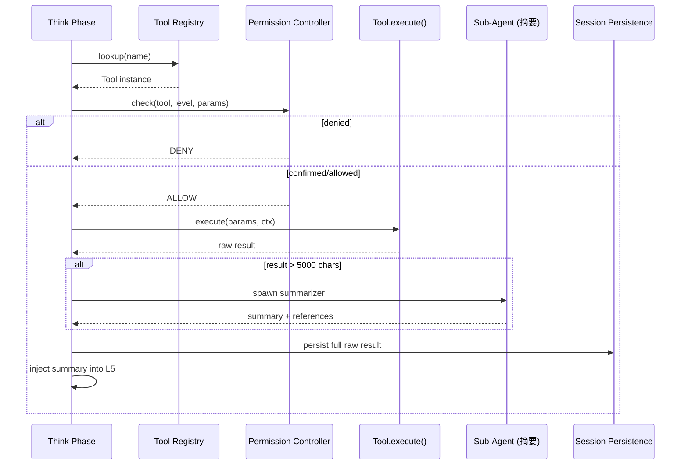

### MCP 集成

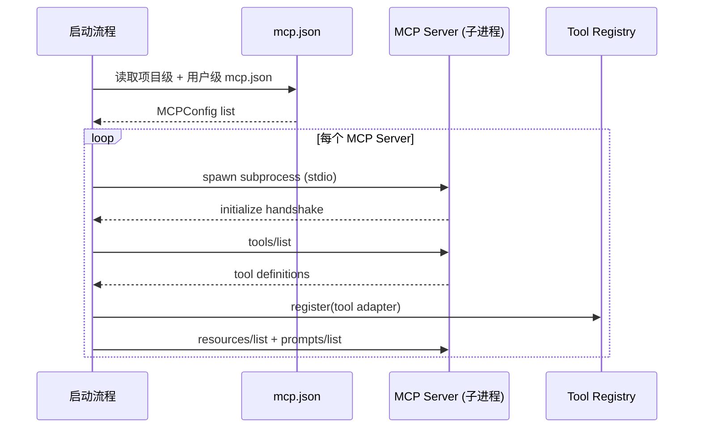

> **实现说明**: 当前 MCP client 是手写 JSON-RPC 实现，通过 transport 抽象支持 stdio 子进程通信和 SSE；实现没有直接调用 `mcp` Python SDK client API。

---

## 五、权限/沙箱系统

### 权限分级

| Level | 描述 | 包含工具 | 默认行为 |
|-------|------|---------|---------|
| 0 | 只读 | read, glob, grep, web_fetch, web_search, task_create, task_update, send_message | 自动放行 |
| 1 | 写入 | write, edit, memory_write | 需确认 |
| 2 | 执行 | bash, spawn_subagent | 需确认 |
| 3 | 网络写入 | 任何修改外部系统的 MCP 工具 | 需显式允许 |

### 确认流程

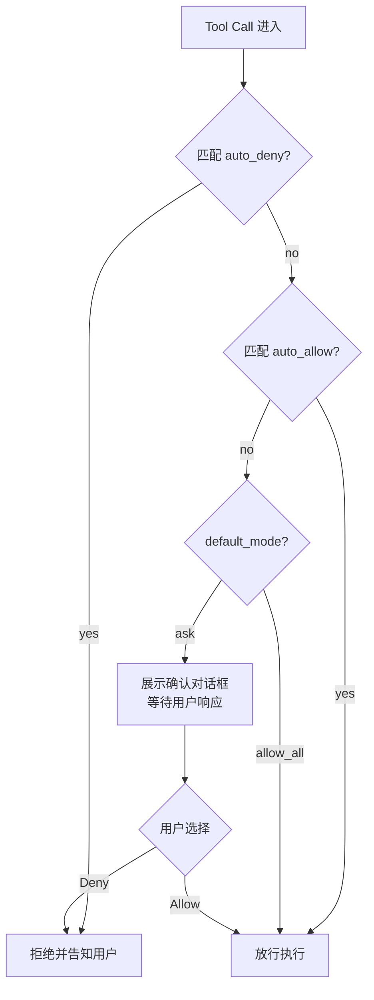

权限确认**不设超时**——一直等待用户明确响应。普通决策反问才设 120s 超时（见第二节）。

### 权限优先级

```
高 ────────────────────────────────────────────────────── 低
1. CLI 标志           --dangerously-skip-permissions
2. 运行时覆盖          对话中自然语言调整
3. 项目级配置          .myagent/config.yaml
4. 用户级配置          ~/.myagent/config.yaml
5. 默认策略            level 0 auto_allow, 其余 ask
```

### 对话内调整

用户通过自然语言调整权限，Agent 理解意图并更新运行时规则。会话结束后询问是否持久化到配置文件。

```
用户: "git 命令不再问我了"
  → Agent: 将 "git *" 加入运行时 auto_allow
  → "好的，以后的 git 命令自动放行。需要写回配置持久化吗？"

用户: "所有操作都不需要确认了"
  → Agent: 切换运行时模式为 allow_all
  → "已切换到全权限模式。"

用户: "除了 rm -rf 之外都放行"
  → Agent: 切 allow_all + auto_deny: ["rm -rf"]
```

---

## 六、记忆系统 + 梦境机制

### 文件级记忆

```
项目级:
<project>/.myagent/memory/
├── MEMORY.md            ← 索引文件
├── coding-style.md      ← 一个事实一个文件
└── known-issues.md

用户级:
~/.myagent/memory/
├── MEMORY.md            ← 全局索引
└── user-preferences.md
```

### 记忆文件格式

```markdown
---
name: coding-style
description: 项目的代码风格约定
metadata:
  type: project
  updated: 2026-07-02
---

本项目使用 snake_case 命名，类型注解必须写。

**Why:** 用户明确要求统一代码风格。

**How to apply:** 写代码前检查。
```

正文中可链接到其他记忆文件 `[[other-memory-name]]`。

### 记忆生命周期

**启动时**: 读取 MEMORY.md 索引 → 语义匹配当前任务 → 加载相关记忆到 L4

**对话中**: memory_write 写入/更新记忆 → 检查是否有覆盖同一事实的旧文件 → 更新而非重复创建 → 可删除过时记忆

**结束时**: 提示"本次对话中新写入/更新了 N 条记忆: [...]"

### 梦境机制

**目的**: 自动整合记忆，回顾对话更新记忆，删除过期记忆，纠正错误记忆，对反复纠正的问题整合为记忆。

**触发条件**（AND 关系）:
- Agent 启动时，距离上次梦境 > 6 小时（可配置 `dream.trigger_hours`）
- 且累计对话轮数 > 50 轮（可配置 `dream.trigger_rounds`）
- 手动触发: `/dream` 或 "回顾一下最近的对话"

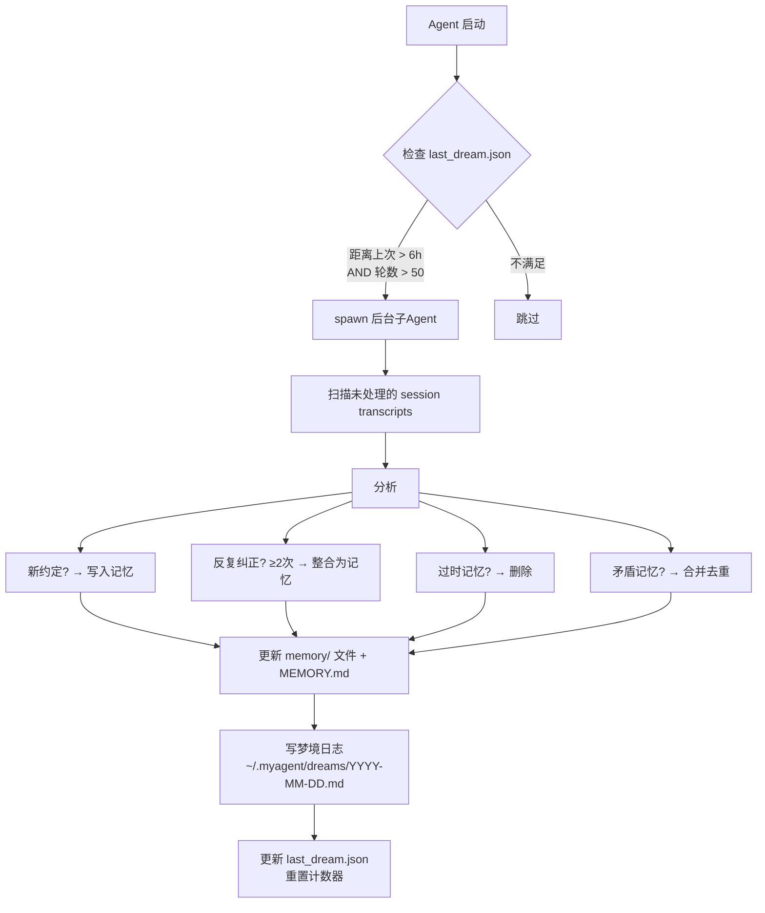

**原则**: 不询问确认、不修改项目代码、静默后台执行。

---

## 七、技能系统

### 架构概述

技能不是代码插件，是**自然语言指令文件**（SKILL.md），指导模型在特定场景下如何行为。技能可以包含辅助资源（脚本、模板、参考文档等），组成一个自包含的目录。

### 技能目录结构

```
skills/
├── <skill-name>/
│   ├── SKILL.md              ← 必需: 技能指令入口
│   ├── references/           ← 可选: 参考文档 (Agent 按需 read)
│   │   ├── api-docs.md
│   │   └── style-guide.md
│   ├── scripts/              ← 可选: 可执行脚本 (Agent 通过 bash 调用)
│   │   ├── validate.sh
│   │   └── setup.py
│   ├── templates/            ← 可选: 模板文件 (Agent 读取后填充)
│   │   └── report.md.j2
│   └── assets/               ← 可选: 其他资源
│       └── config.example.yaml
```

### 多级技能目录搜索

技能按以下优先级加载，项目级覆盖用户级，用户级覆盖内置。同名技能目录，高优先级**完全取代**低优先级（而非合并文件）：

```
内置技能 (安装包内)         ← 优先级最低
用户级 (~/.myagent/skills/)  ← 优先级中等
项目级 (.myagent/skills/)    ← 优先级最高
```

### SKILL.md 格式

```markdown
---
name: code-review
description: 代码审查，检查正确性、安全性、性能问题
---

## 何时使用
用户要求 review、审查代码、检查 PR 时触发。

## 流程
1. 获取变更文件列表
2. 逐文件审查: 安全 → 正确性 → 性能 → 可维护性
3. 输出结构化审查报告

## 注意事项
- 使用最高思考模式 (Think Max) 进行深度审查

## 可用资源
- `references/security-checklist.md` — 安全检查清单
- `scripts/lint.sh` — 运行 lint 检查
```

### 脚本和 references 的处理方式

- **scripts/**: 技能系统本身不执行脚本。SKILL.md 中声明后，Agent 在合适的时机通过 bash 工具调用执行。脚本路径相对于技能目录根，大型脚本的输出由 Agent 自行判断是否摘要
- **references/**: 不随 SKILL.md 一起加载（避免塞满上下文）。invoke 技能时，references 文件列表作为"可用参考"注入 system prompt，Agent 需要时自行 `tool_call: read("{skill_dir}/references/xxx.md")` 按需读取
- **templates/**: Agent 读取模板后填充内容，通过 write 工具写入目标路径
- **assets/**: Agent 按需读取使用

### 技能发现和加载流程

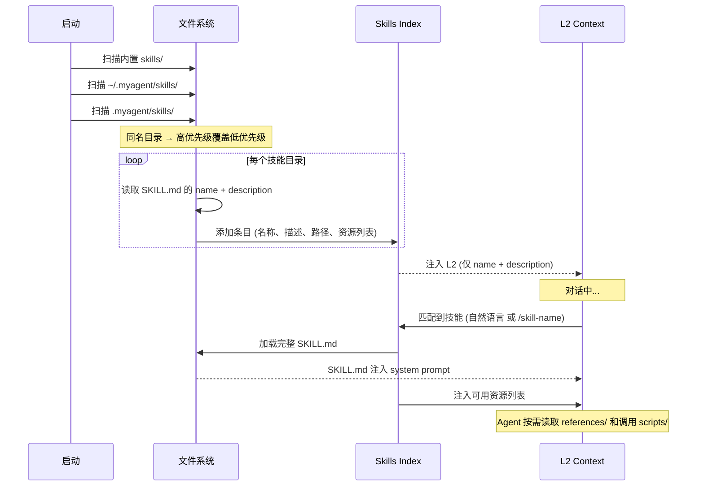

### 调用方式

- **自然语言触发**: 模型看到 L2 中的技能 index，自行判断用户意图是否匹配
- **强制调用**: `/skill-name` 前缀，强制加载并执行指定技能
- **列出技能**: `/skills` 列出所有可用技能及描述

### 技能调用实现机制

技能在引擎内部通过**虚拟工具 `skill_invoke`** 实现触发：

1. 模型的 L2 上下文包含所有技能的 `name + description` 索引
2. 当模型判断当前任务需要某个技能时，它输出一个 `tool_call(name="skill_invoke", params={"skill": "<name>"})`
3. 引擎拦截这个虚拟工具调用（不经过 ToolRegistry，不触发权限检查），加载完整 SKILL.md 注入 system prompt
4. 下一轮 ReAct 循环中，模型按照技能指令执行

这个机制利用现有的 function calling 通道，避免了额外的上下文匹配逻辑，同时保持技能内容按需加载（不占用 L2 空间）。`skill_invoke` 不出现在 L1 tools schema 中（它不是可被发现和调用的普通工具），由引擎在 Think→Decision 阶段内部处理。

### 内置技能（计划）

| 技能 | 用途 | 资源 |
|------|------|------|
| brainstorming | 需求探索和设计脑暴 | references/ |
| code-review | 代码审查 | references/security-checklist.md, scripts/ |
| systematic-debugging | 系统化调试 | — |
| tdd | 测试驱动开发 | templates/ |
| writing-plans | 编写实现计划 | — |
| executing-plans | 按计划执行实现 | — |

---

## 八、子 Agent 池与工作流编排

### 子 Agent 生命周期

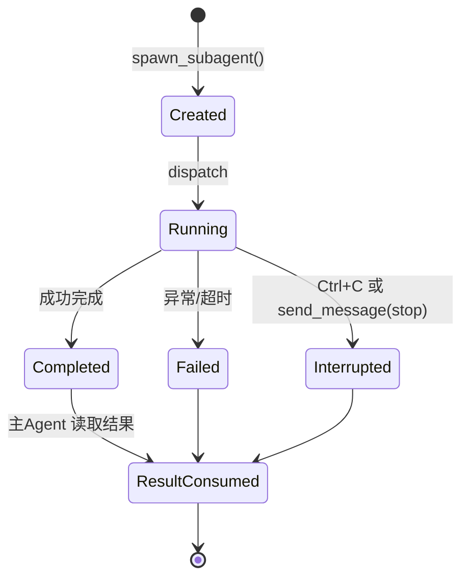

### 池管理

- **最大并发**: `min(16, os.cpu_count() - 2)`
- **全局上限**: 单次会话 1000 个子Agent
- **排队**: 超出并发限制的子Agent 排队等待槽位

### 主 Agent ↔ 子 Agent 交互

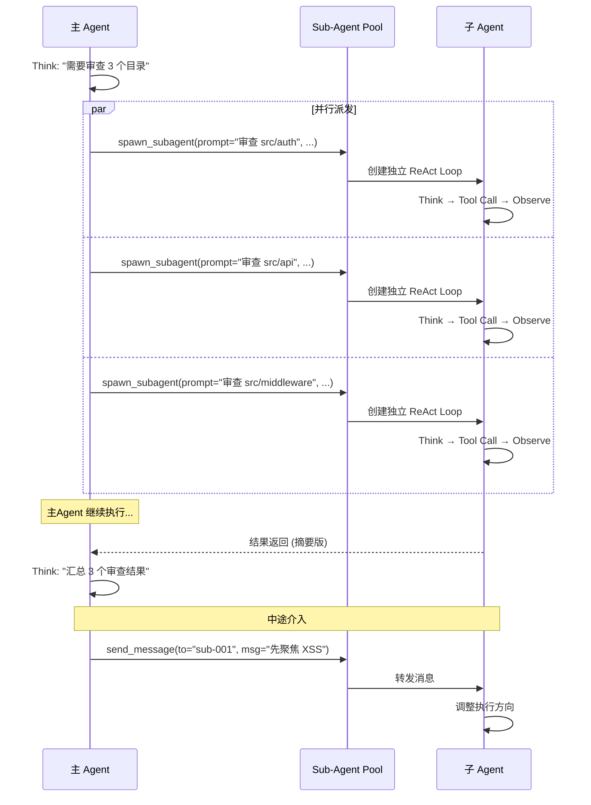

### background 规则

| 场景 | background | 原因 |
|------|-----------|------|
| Goal 模式拆解的并行子任务 | true (默认允许) | 主Agent 继续推进其他任务 |
| 子任务间有依赖，需要结果才能继续 | false | 必须等待 |
| 非 Goal 模式的"顺便"探索 | false (默认禁止) | 额外 token 消耗，需显式配置开启 |

### Agent Inspector Pane 展示

Inspector 是主界面右侧固定窗格，用于展示运行状态，而不是弹出式详情窗或一次性状态栏。它默认展示以下分区：

- **Session**: 会话 ID、项目名、当前模型、思考模式
- **Tokens**: 当前轮输入/输出 token、会话累计 token、上下文占用百分比、压缩阈值提示
- **Goal**: goal 名称、状态、预算使用情况、是否等待用户输入
- **Sub-agents**: active/queued/completed/failed 计数，以及每个子 Agent 的任务摘要、状态、耗时、重试次数、结果摘要
- **Tools**: 当前工具调用、最近工具调用结果、权限等待状态
- **Health**: LLM 重试、MCP 连接、最近错误摘要

```
┌─ Conversation ───────────────────────────────┬─ Agent Inspector ───────────┐
│ Assistant streaming output...                │ Model: deepseek-v4-pro       │
│ Queue  | next pending user message           │ Mode: Think High             │
│                                              │ Tokens: 156K / 1M  15.6%     │
│                                              │ Context: OK                  │
│                                              │ Goal: code review loop       │
│                                              │                              │
│                                              │ Sub-agents 3 active          │
│                                              │ review-auth       running    │
│                                              │ review-api        done 2     │
│                                              │ review-middleware retry 1/3  │
│                                              │                              │
│                                              │ Tool: shell_command          │
└─ Input ──────────────────────────────────────┴──────────────────────────────┘
```

响应式规则：

- `terminal_columns >= 120`: 右侧固定完整窗格，宽度默认 34 列，可配置为 28-48 列
- `terminal_columns < 120`: 自动折叠为 4-6 列 rail，仅保留 token/context、活跃子 Agent 数、错误/等待状态
- `F2`: 在当前终端尺寸下临时展开/收起完整 Inspector；空间不足时保持 rail 模式，不覆盖输入区或提交当前输入

数据流：

```mermaid
flowchart LR
    Engine[Agent Engine] --> Status[RuntimeStatusModel]
    LLM[LLM Provider] --> Status
    Tools[Tool Registry] --> Status
    Pool[Sub-Agent Pool] --> Status
    Goal[Goal Tracker] --> Status
    Status --> Pane[AgentInspectorPane.render(snapshot)]
    Pane --> Layout[Rich Layout + single Live owner]
```

测试要求：

- 渲染测试覆盖完整窗格、rail、长任务名截断、无子 Agent、错误摘要
- 状态聚合测试覆盖 LLM token 回写、工具调用状态、子 Agent 生命周期、goal 状态
- 布局测试覆盖 80/120/160 列终端，确保 Inspector 不遮挡输入区、不挤压流式输出到不可读
- REPL 集成测试确保 Rich Live 只有一个所有者，prompt_toolkit 焦点稳定，流式输出和状态刷新不会互相打断

---

## 九、配置系统

### 配置优先级（7 层）

```
高 ────────────────────────────────────────────────────── 低
1. CLI 启动参数           myagent --mode think-max
2. 运行时覆盖              对话中自然语言调整
3. 项目级 config.yaml      .myagent/config.yaml
4. 项目级 AGENT.md         项目上下文指导
5. 用户级 config.yaml      ~/.myagent/config.yaml
6. 用户级 AGENT.md         ~/.myagent/AGENT.md
7. 内置默认值              硬编码 fallback
```

### 完整配置项

```yaml
# ~/.myagent/config.yaml

model:
  provider: deepseek
  model: deepseek-v4-pro
  thinking: Think High          # Think High | Think Max | Non-think
  fallback_models: []

context:
  compression:
    primary_threshold: 0.75     # 自动压缩触发点
    target_after: 0.30          # 压缩后目标
    hard_limit: 0.90
    minimum_messages: 10
    minimum_savings: 0.10

permissions:
  default_mode: ask             # ask | allow_all
  auto_allow:
    levels: [0]
    paths: []
    commands: []
  auto_deny:
    paths: [".env", "*.key", "*.pem"]
    commands: ["sudo", "rm -rf /"]

subagents:
  # null = auto: min(16, max(1, os.cpu_count() - 2))
  max_concurrent: null
  speculative_exploration: false

dream:
  trigger_hours: 6
  trigger_rounds: 50
  enabled: true

tools:
  tool_result_max_chars: 5000
  shell_timeout_seconds: 120

ui:
  status_pane:
    enabled: true
    placement: right
    width: 34
    min_width: 28
    max_width: 48
    collapse_below_columns: 120
    rail_width: 5
    toggle_key: f2
    sections: [session, tokens, goal, subagents, tools, health]
  # Backward compatibility: show_status_bar/status_bar_items map to status_pane.enabled/sections.
  streaming: true
  syntax_highlight: true

session:
  save_transcripts: true
  transcript_format: [json, markdown]
  sessions_dir: ~/.myagent/sessions/

logging:
  level: INFO                    # DEBUG | INFO | WARNING | ERROR
  dir: ~/.myagent/logs/
  format: jsonl                  # jsonl | text | both
  max_size_mb: 100               # 单文件最大体积，超出后轮转
  retention_days: 30             # 自动清理超过 N 天的日志
  llm_prompts: false             # 是否在 DEBUG 日志中记录完整 LLM prompt（含上下文，体积大）
```

### 配置合并策略

多层配置通过 deep-merge 合并：

- **字典**: 递归深度合并（子键逐层覆盖）
- **标量**: 高优先级直接替换低优先级
- **列表**: 高优先级**完全替换**低优先级（非追加）。这意味着用户配置中的 `auto_allow.commands` 会覆盖默认值而非追加。如需追加，需在高层配置中完整列出所有条目。此设计避免了"哪些项该合并、哪些该替换"的歧义，用户可通过复制默认配置并在其基础上修改来达到期望效果

---

## 十、会话系统与项目感知

### 环境感知

Agent 启动时自动检测项目环境：

```python
class ProjectContext:
    def detect(self, project_dir: Path) -> dict:
        return {
            # Git
            "is_git_repo": True,
            "git_branch": "main",
            "git_status": "2 files modified",

            # 项目类型
            "project_type": "python",      # python | node | go | ...
            "package_manager": "uv",       # uv | pip | poetry | npm | pnpm | yarn
            "python_version": "3.12",
            "build_system": "make",        # Makefile | pyproject | ...
            "test_framework": "pytest",
            "linter": "ruff",

            # 目录结构
            "structure_summary": "src/ tests/ docs/",
        }
```

### 会话列表展示

```
$ myagent --list-sessions

MyAgentCLI (D:\code\MyAgentCLI):
  2026-07-02-abc123  ✅ "设计 MyAgentCLI 架构"    2.3h  238K tk  Goal ✓
  2026-07-01-xyz789  📋 "审查代码安全"             0.8h   45K tk  —
  2026-06-30-def456   —  "重构记忆模块"            1.1h   89K tk  Goal ⏳
```

### 会话结束流程

当用户执行 `/exit`、`/quit` 或 Ctrl+D 退出时，按以下顺序执行：

1. AgentEngine 停止当前 ReAct 循环（如正在执行）
2. `SessionManager.end_session()` 被调用：
   a. 标记 session 为 closed，写入 transcript 结束标记
   b. 检查运行时权限是否有修改 → 如有，通过 Rich console 输出提示（此时 prompt_toolkit 已停止，使用 `Console.print()`）：
      "本次会话中调整了 N 条权限规则，是否持久化到配置文件？[Y/n]"
   c. 用户确认后写入对应配置文件
   d. 调用 `memory_store.get_session_writes()` → 输出记忆变更摘要
3. Agent Inspector Pane 停止统一 Live display
4. 进程正常退出（exit code 0）

Ctrl+C 在 idle 状态时触发同样的退出流程（先确认 "Exit? (y/n)"）。

---

## 十一、日志系统

### 概述

日志系统统一记录 Agent 运行时的关键事件，覆盖系统生命周期、LLM 交互、工具调用、错误异常等。所有日志写入配置的日志目录，支持 JSON Lines 结构化格式以便后续分析和排查。

### 日志目录

```
~/.myagent/logs/
├── myagent-2026-07-03.jsonl     ← 结构化日志（默认格式）
├── myagent-2026-07-03.log       ← 可选：人类可读文本
├── myagent-2026-07-02.jsonl
└── myagent-2026-07-02.log
```

按天轮转，单文件超过 `max_size_mb` 时追加序号后缀（`myagent-2026-07-03.1.jsonl`）。超过 `retention_days` 的日志自动清理。

### 日志级别

| 级别 | 用途 | 示例事件 |
|------|------|----------|
| `DEBUG` | 详细诊断信息 | 完整 LLM prompt、上下文结构、token 估算细节 |
| `INFO` | 关键运行时事件 | 工具调用、会话开始/结束、子Agent 派发/完成、配置加载 |
| `WARNING` | 需关注但非致命 | LLM 重试、压缩事件、接近限额、权限变更 |
| `ERROR` | 错误和异常 | LLM API 失败（重试耗尽）、工具执行异常、MCP 连接断开 |

### 日志事件分类

每条日志为一条 JSON 记录，包含公共字段 + 分类特有字段：

**公共字段**（每条日志都包含）:
```json
{
  "timestamp": "2026-07-03T14:32:01.123Z",
  "level": "INFO",
  "category": "llm",
  "session_id": "2026-07-03-abc123",
  "project": "myagentcli",
  "message": "LLM API call completed",
  "pid": 12345
}
```

**分类事件**（`category` + 特有字段）:

| Category | 记录时机 | 特有字段 |
|----------|----------|----------|
| `system` | 启动、关闭、配置加载 | `event` (startup/shutdown/config_reload), `config_hash`, `python_version`, `platform` |
| `llm` | 每次 API 调用 | `model`, `thinking_mode`, `messages_count`, `estimated_tokens`, `latency_ms`, `completion_tokens`, `prompt_tokens`, `retry_count`, `stream` (bool) |
| `tool` | 每次工具执行 | `tool_name`, `params_summary`（截断到 200 字符）, `permission_result`, `duration_ms`, `result_size_chars`, `error`（如有） |
| `agent` | ReAct 循环事件 | `iteration`, `event` (text/tool_call/done/ask_user/interrupted), `goal`（如有）, `tokens_used_this_turn` |
| `subagent` | 子Agent 生命周期 | `subagent_id`, `event` (spawned/completed/failed/interrupted), `parent_session`, `prompt_summary`, `duration_ms` |
| `error` | 任何异常 | `exception_type`, `traceback`, `context`（触发时的操作描述）, `component`（llm/tool/agent/mcp/system/memory/subagent；与现有日志 category 对齐：LLM、工具、Agent、MCP、系统、记忆、子Agent） |

说明：严格的 all-except 异常日志契约会记录 expected fallback/control-flow exceptions；后续可通过结构化字段或过滤策略优化噪音，但当前契约优先保证可审计性。

### LLM 交互记录

每次 LLM API 调用产生两条日志：

1. **请求日志** (`INFO`, category=`llm`, event=`request`): 不含完整 prompt 文本，只记录元数据
   ```json
   {
     "category": "llm", "event": "request",
     "model": "deepseek-v4-pro", "thinking_mode": "Think High",
     "messages_count": 34, "estimated_tokens": 124000,
     "tools_count": 14, "stream": true
   }
   ```

2. **响应日志** (`INFO`, category=`llm`, event=`response`): 含 token 消耗和延迟
   ```json
   {
     "category": "llm", "event": "response",
     "model": "deepseek-v4-pro",
     "latency_ms": 2340, "prompt_tokens": 121500,
     "completion_tokens": 3400, "total_tokens": 124900,
     "tool_calls_count": 2, "retry_count": 0
   }
   ```

当 `logging.llm_prompts=true` 且日志级别为 `DEBUG` 时，另写入 `.prompts/` 子目录的单独文件（避免 JSONL 行过长）：
```
~/.myagent/logs/.prompts/
└── 2026-07-03T14-32-01-abc123-request.json    ← 完整 messages + tools
└── 2026-07-03T14-32-04-abc123-response.json   ← 完整 response
```

### 实现概览

基于 Python 标准库 `logging` 模块构建：

```
myagent/logging/
├── __init__.py          # 公开 API: get_logger(), setup()
├── logger.py            # LogManager — 初始化、轮转、清理
├── formatter.py         # JsonLineFormatter — 自定义 logging.Formatter
└── context.py           # LogContext — 线程安全的 session/project 绑定
```

- `LogManager.setup(config: LoggingConfig)` — 应用启动时调用一次，创建 logger 树
- `get_logger(name: str) -> logging.Logger` — 获取带上下文的 logger，等价于 `logging.getLogger(f"myagent.{name}")`
- `LogContext` — 通过 `contextvars` 绑定 session_id 和 project_name，使每条日志自动携带（无需在调用处手动传参）
- 日志文件通过 `logging.handlers.TimedRotatingFileHandler` 按天轮转 + `RotatingFileHandler` 按大小轮转组合
- JSON 格式: 自定义 `logging.Formatter`，构造 dict 后 `json.dumps` 输出单行

### 性能考虑

- 日志写入使用**异步队列**（`QueueHandler` + `QueueListener`），不阻塞主线程
- 工具调用日志中 `params_summary` 截断到 200 字符，避免大参数撑大日志
- LLM prompt 完整记录仅在 `llm_prompts=true` 时启用，且写入独立文件，不污染主 JSONL 流
- 日志文件大小通过 `max_size_mb` + `retention_days` 双重控制

### 配置项

```yaml
logging:
  level: INFO                    # DEBUG | INFO | WARNING | ERROR
  dir: ~/.myagent/logs/
  format: jsonl                  # jsonl | text | both
  max_size_mb: 100
  retention_days: 30
  llm_prompts: false             # 开启后 DEBUG 级别写入完整 LLM prompt
```

---

| 组件 | 选型 | 原因 |
|------|------|------|
| 语言 | Python 3.12+ | 快速开发, AI/LLM 生态强 |
| CLI 输入 | prompt_toolkit | 自动补全、语法高亮、历史搜索、多行编辑 |
| CLI 输出 | Rich | Markdown 渲染、Panel/Layout、Live 实时刷新 |
| 模型接入 | LiteLLM | 上百模型统一抽象，后续换模型只需改配置 |
| 基础模型 | DeepSeek V4 Pro | 1M 上下文，1.6T/49B MoE，MIT 协议 |
| MCP 协议 | 手写 JSON-RPC client | 行业标准协议，子进程 stdio/SSE 通信；未直接调用 mcp SDK client API |
| 配置格式 | YAML | 人类可读，多层合并方便 |
| 持久化 | JSON + Markdown | JSON 结构化，Markdown 人类可读 |
| 分发 | pipx / pip (PyPI) | Python CLI 工具标准分发方式 |

---

## 2026-07-07 CLI Runtime UX Addendum

This addendum supersedes older CLI display behavior where tool output,
permission prompts, and thinking state were rendered as ordinary transcript
messages.

### Text Decoding

All subprocess, tool, MCP stderr, and UI status text must pass through a
shared decoding/sanitizing path before display. Byte output is decoded as UTF-8
first, then GB18030, then the local preferred encoding and Windows console
encodings, and only then falls back to replacement decoding. UI sanitization strips
ANSI/control characters but must not re-encode valid Unicode.

### Permission Prompt Tray

Tool permission confirmation is a transient prompt tray directly above the
bottom input area. It is not persisted into the visible transcript. The tray
shows the tool name, permission level, shortened parameters, and the accepted
choices: `A` allow once, `D` deny, `Y` allow all. After the user submits a
choice, the tray disappears. The inspector may still show `permission waiting`
while the tray is active.

### Folded Tool Output

Tool calls appear in the transcript as compact folded entries by default:
`Tool | <name> - running`, then `Tool | <name> - done - <duration> - <summary>`
or `Tool | <name> - failed - <summary>`. Full stdout/stderr is stored in the
display entry but hidden unless the user expands the current/recent tool. `F3`
toggles expanded details for the currently running tool, or for the most
recently completed tool when no tool is running. This mirrors the Claude Code
style: routine tool execution stays visible without consuming the conversation
space.

### Thinking Indicator

Thinking chunks are not written into the transcript. While the model is
reasoning, the CLI shows `Thinking <elapsed>s` in the inspector and as a compact
status line above the input area. The timer starts on the first thinking event
or at the beginning of an agent run, refreshes while active, and stops when the
agent starts normal output, calls a tool, asks a user question, finishes, or
errors.

### Mouse Selection And Copy

The chat window must preserve normal terminal/browser text selection and copy by
default. Prompt-toolkit mouse reporting is disabled unless the user explicitly
sets `ui.chat_window.mouse_support: true`. When mouse support is enabled, the
application may capture mouse drag and wheel events for terminal mouse handling;
when disabled, keyboard scrolling remains available and the host terminal owns
selection/copy.
